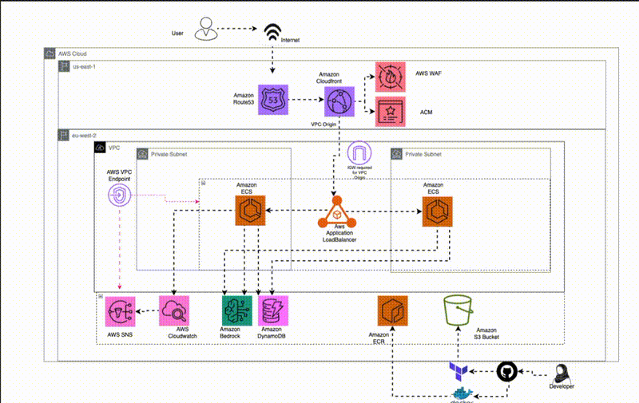
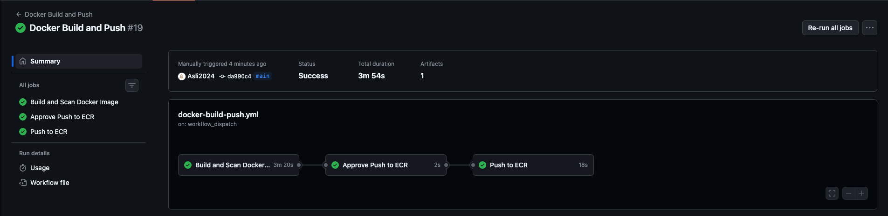
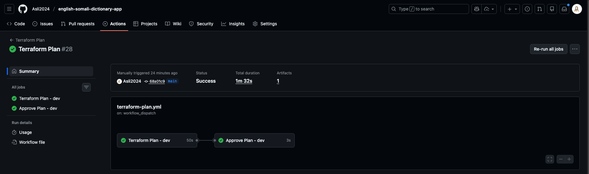
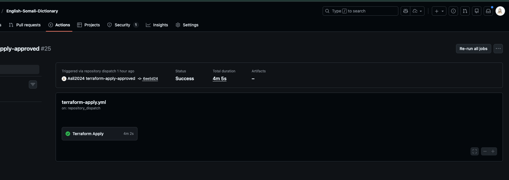
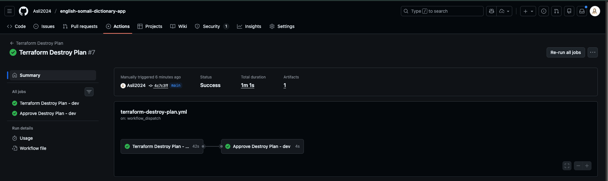
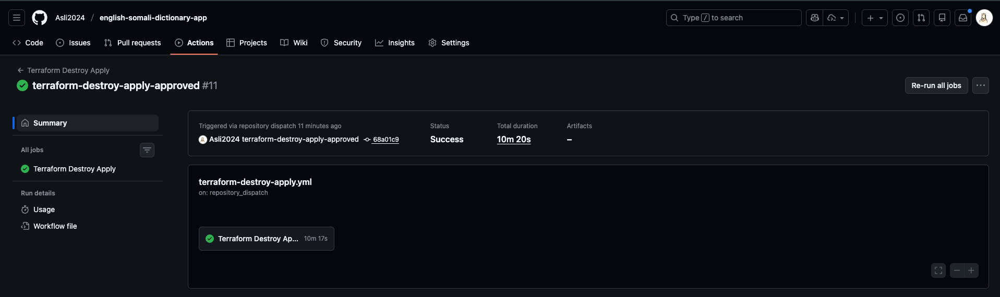

# English Somali Dictionary App

The **English Somali Dictionary App** is a production-ready, cloud-native translation service built on **AWS ECS Fargate** and provisioned entirely using **Terraform**.

It provides real-time English → Somali translation using **Amazon Bedrock** foundation models, with **optional DynamoDB caching** to improve performance and reduce inference costs.

The application is designed to run in two modes:

* **Local development** – fast iteration, minimal dependencies, DynamoDB optional
* **AWS production** – fully managed, secure, scalable, and highly available

---

## Local Deployment with Docker

To run the English Somali Dictionary app locally using Docker:

1. **Build the Docker image:**
   ```bash
   cd english-dictionary
   docker build -t english-somali-dictionary .
   ```

2. **Run the Docker container (with required AWS credentials):**
   ```bash
   docker run -p 8000:8000 \
     -e AWS_REGION=eu-west-2 \
     -e AWS_ACCESS_KEY_ID=<your-access-key-id> \
     -e AWS_SECRET_ACCESS_KEY=<your-secret-access-key> \
     -e USE_DYNAMODB=False \
     english-somali-dictionary
   ```

3. **Access the API at:**
   [http://localhost:8000/](http://localhost:8000/)

4. **Watch the demo:**

   [Watch Local Demo](https://www.loom.com/share/06e87610f41940f89303b1f0bb9ee2bb)


## Live Deployment


## Key Features

* **FastAPI backend** for real-time translation APIs
* **Amazon Bedrock integration** for AI-powered English → Somali translation
* **Optional DynamoDB Global Table** for translation caching
  * Enabled in cloud deployments
  * Disabled by default for local development
* **ECS Fargate** for serverless container orchestration
* **Internal Application Load Balancer (ALB)** fronted by **CloudFront**
* **AWS WAF** for edge protection
* **ACM-managed TLS certificates**
* **Customer-managed KMS keys** for encryption at rest
* **End-to-end CI/CD** with GitHub Actions
* **Modular Terraform architecture** following AWS and DevOps best practices

---

## Architecture Overview



At a high level, the system consists of:

* A **FastAPI container** running on ECS Fargate
* An **internal ALB** that is not publicly accessible
* **CloudFront** providing HTTPS termination, request routing, and caching control
* **Amazon Bedrock** for inference using managed foundation models
* **DynamoDB Global Table (optional)** for caching translation results
* A **VPC with private subnets**, VPC endpoints, and restricted network access
* **IAM roles with least-privilege permissions**
* **Observability** via CloudWatch dashboards and alarms

---

## DynamoDB Caching

Translations can be cached in **DynamoDB** to:

* Reduce repeated calls to Amazon Bedrock
* Improve response latency
* Enable cross-region consistency using Global Tables

### Important Notes

* DynamoDB is **optional for local development**
* When running locally, the application can operate **without DynamoDB**
* Caching behaviour is controlled via environment variables defined in:
  * `english-dictionary/app/config.py`
  * `english-dictionary/app/bedrock_client.py`

This approach allows fast local iteration while keeping production deployments optimised and cost-efficient.

---


## Repository Structure

```text
English-Somali-Dictionary/
├── README.md
├── bootstrap/
│   ├── README.md
│   ├── main.tf
│   ├── provider.tf
│   └── variables.tf
├── english-dictionary/
│   ├── Dockerfile
│   ├── README.md
│   ├── app/
│   │   ├── __init__.py
│   │   ├── bedrock_client.py
│   │   ├── config.py
│   │   ├── main.py
│   │   └── prompts.py
│   ├── requirements.txt
│   └── static/
│       ├── app.js
│       ├── index.html
│       └── styles.css
├── images/
│   ├── architecture-design.gif
│   ├── docker-build-push.png
│   ├── terraform-apply.png
│   ├── terraform-destroy-apply.png
│   ├── terraform-destroy-plan-and-approve.png
│   └── terraform-plan-and-approve.png
└── terraform/
    ├── README.md
    ├── backend.tf
    ├── config/
    │   ├── dev/
    │   ├── prod/
    │   └── staging/
    ├── data.tf
    ├── main.tf
    ├── modules/
    │   ├── acm/
    │   ├── alb/
    │   ├── cloudfront/
    │   ├── cloudwatch_alarm/
    │   ├── cloudwatch_dashboard/
    │   ├── dynamodb/
    │   ├── ecr/
    │   ├── ecs/
    │   ├── gateway_endpoint/
    │   ├── iam/
    │   ├── interface_endpoint/
    │   ├── route53/
    │   ├── s3/
    │   ├── security_groups/
    │   ├── vpc/
    │   └── waf/
    ├── provider.tf
    └── variables.tf
```

## CI/CD

GitHub Actions workflows provide:

* Pre-commit validation
* Docker image build and security scanning
* Terraform plan and apply per environment
* Environment-specific deployments
* Manual approval gates for production

All workflows are located in `.github/workflows/`.

[Docker Build, Scan , Approve and Push Run](https://github.com/Asli2024/english-somali-dictionary-app/actions/runs/20559959729): 

[Terraform Plan and Approve Run](https://github.com/Asli2024/english-somali-dictionary-app/actions/runs/20582733051): 


[Terraform Apply Run](https://github.com/Asli2024/english-somali-dictionary-app/actions/runs/20581670999): 


[Terraform Destroy Plan and Approve](https://github.com/Asli2024/english-somali-dictionary-app/actions/runs/20582256286): 


[Terraform Destroy Apply](https://github.com/Asli2024/english-somali-dictionary-app/actions/runs/20582272373): 

---
## Contributing

1. Fork the repository
2. Create a feature branch
3. Commit changes with pre-commit checks passing
4. Open a pull request
